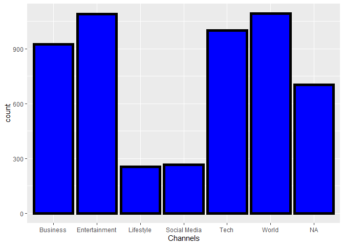
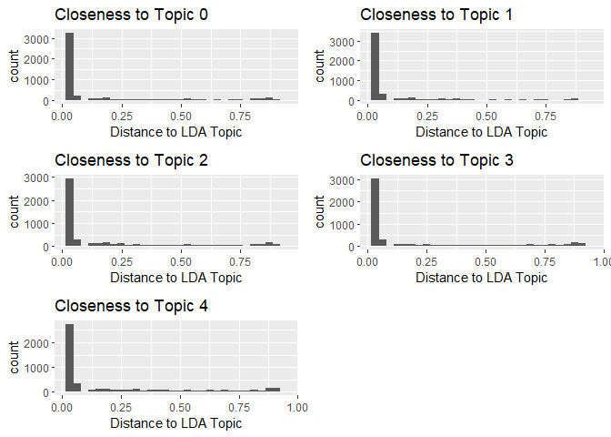

RMarkDown
================
Xinyu Hu
6/28/2020

  - [About the data](#about-the-data)
  - [Summarization](#summarization)
      - [Simple Statistics](#simple-statistics)
      - [Simple Plots](#simple-plots)
  - [Modeling](#modeling)
      - [Ensemble model](#ensemble-model)
      - [Linear Regression Model](#linear-regression-model)
      - [Model Selection](#model-selection)

\#Introduction

This is a practice project of ST558 course at NC State. The data is
offered by [UCI Machine Learning
Repository](https://archive.ics.uci.edu/ml/datasets/Online+News+Popularity).  
The data set is made of statistics associsated with articles published
by Mashable. It includes 61 attributes, among which are 58 predictive
attributes, 2 non-predictive and 1 goal (reponse) field.  
The goal of this project, from my perspective, is practicing modeling
using R with both linear model and non linear model.The purpose of this
project is to find a relatively better way to predict *Number of Shares*
of those articles, using the provided associated
    statistics.

# About the data

``` r
colnames(News)
```

    ##  [1] "url"                           "timedelta"                    
    ##  [3] "n_tokens_title"                "n_tokens_content"             
    ##  [5] "n_unique_tokens"               "n_non_stop_words"             
    ##  [7] "n_non_stop_unique_tokens"      "num_hrefs"                    
    ##  [9] "num_self_hrefs"                "num_imgs"                     
    ## [11] "num_videos"                    "average_token_length"         
    ## [13] "num_keywords"                  "data_channel_is_lifestyle"    
    ## [15] "data_channel_is_entertainment" "data_channel_is_bus"          
    ## [17] "data_channel_is_socmed"        "data_channel_is_tech"         
    ## [19] "data_channel_is_world"         "kw_min_min"                   
    ## [21] "kw_max_min"                    "kw_avg_min"                   
    ## [23] "kw_min_max"                    "kw_max_max"                   
    ## [25] "kw_avg_max"                    "kw_min_avg"                   
    ## [27] "kw_max_avg"                    "kw_avg_avg"                   
    ## [29] "self_reference_min_shares"     "self_reference_max_shares"    
    ## [31] "self_reference_avg_sharess"    "weekday_is_monday"            
    ## [33] "weekday_is_tuesday"            "weekday_is_wednesday"         
    ## [35] "weekday_is_thursday"           "weekday_is_friday"            
    ## [37] "weekday_is_saturday"           "weekday_is_sunday"            
    ## [39] "is_weekend"                    "LDA_00"                       
    ## [41] "LDA_01"                        "LDA_02"                       
    ## [43] "LDA_03"                        "LDA_04"                       
    ## [45] "global_subjectivity"           "global_sentiment_polarity"    
    ## [47] "global_rate_positive_words"    "global_rate_negative_words"   
    ## [49] "rate_positive_words"           "rate_negative_words"          
    ## [51] "avg_positive_polarity"         "min_positive_polarity"        
    ## [53] "max_positive_polarity"         "avg_negative_polarity"        
    ## [55] "min_negative_polarity"         "max_negative_polarity"        
    ## [57] "title_subjectivity"            "title_sentiment_polarity"     
    ## [59] "abs_title_subjectivity"        "abs_title_sentiment_polarity" 
    ## [61] "shares"

As we know before, there are 61 fields. According to the [data
description](https://archive.ics.uci.edu/ml/datasets/Online+News+Popularity),
from column \#3 to columns \#60 are the predictors. While I have no
knowledge about each of them, I can see there are a couple of
perspecives that we can group them.  
1\) *Column 3 to Column 13* are all numeric predictors. Among them,
Column 3 to Column Column 7, and column 12 are about tokens of the
article; Column 8 to Column Column 11, and column 13 are about the
links, image, video, and keywords of the articles.  
2\) *Column 14 to Column 19* are all about the topic, or channel of the
data. So here it will tag 7 types of channels: Lifestyle, Entertainment,
Business, Social Media, Tech and World.  
3\) *Column 20 to Column 28* are all about key word. For example, worst
keyword, best keyword, average keyword, etc.  
4\) *Column 29 to Column 31* are about self reference. They capture the
min, avg and max shares of referenced atritles in mashable.  
5\) *Colun 32 to Column 29* is aboue the timing of the article. Those
are flags to tag out if the article is published in Monday to Sunday,
and also if it’s on weekend.  
6\) *Column 40 to Column 44* are about the Closeness to LDA topics, with
topic 0 to topic 4 respectively.  
7\) *Colum 45 to Column 60* are all about [Natural Language Processing
(NLP)](https://en.wikipedia.org/wiki/Natural_language_processing) result
of the artcle. They include polarity, subjectivity, sentiment of the
article.

To start the analysis, we first look at Monday data, and use Rmarkdown
*Knit with Parameter* for all the weekdays. Also, a 70-30 split will be
made for modeling training and testing. Last but not least, I choose to
predict a binary response, which is dividing the shares into two groups
(\< 1400 and \>=1400).

# Summarization

As all the predictors are numeric, now we can start to explore some
feature of them.

## Simple Statistics

1)  Variables describing the tokens are of great interest of me. So I
    want to know the simple statistics before I jump into prediction
    (also I can check if there is any
    missing).

<!-- end list -->

``` r
summary(DataTrain[,3:7])
```

    ##  n_tokens_title n_tokens_content n_unique_tokens  n_non_stop_words
    ##  Min.   : 2.0   Min.   :   0     Min.   :0.0000   Min.   :0.0000  
    ##  1st Qu.: 9.0   1st Qu.: 251     1st Qu.:0.4738   1st Qu.:1.0000  
    ##  Median :10.0   Median : 406     Median :0.5415   Median :1.0000  
    ##  Mean   :10.4   Mean   : 546     Mean   :0.5307   Mean   :0.9707  
    ##  3rd Qu.:12.0   3rd Qu.: 718     3rd Qu.:0.6083   3rd Qu.:1.0000  
    ##  Max.   :18.0   Max.   :7764     Max.   :0.9143   Max.   :1.0000  
    ##  n_non_stop_unique_tokens
    ##  Min.   :0.0000          
    ##  1st Qu.:0.6286          
    ##  Median :0.6916          
    ##  Mean   :0.6734          
    ##  3rd Qu.:0.7553          
    ##  Max.   :1.0000

2)  Another interesting perspectives are about the NLP metrics. So I
    perform summary function on them as well (also I can check if there
    is any
    missing):

<!-- end list -->

``` r
summary(DataTrain[,47:58])
```

    ##  global_rate_positive_words global_rate_negative_words rate_positive_words
    ##  Min.   :0.00000            Min.   :0.000000           Min.   :0.0000     
    ##  1st Qu.:0.02847            1st Qu.:0.009646           1st Qu.:0.6000     
    ##  Median :0.03856            Median :0.015416           Median :0.7097     
    ##  Mean   :0.03926            Mean   :0.016723           Mean   :0.6812     
    ##  3rd Qu.:0.04983            3rd Qu.:0.021599           3rd Qu.:0.8000     
    ##  Max.   :0.12500            Max.   :0.092160           Max.   :1.0000     
    ##  rate_negative_words avg_positive_polarity min_positive_polarity
    ##  Min.   :0.0000      Min.   :0.0000        Min.   :0.00000      
    ##  1st Qu.:0.1852      1st Qu.:0.3047        1st Qu.:0.05000      
    ##  Median :0.2800      Median :0.3584        Median :0.10000      
    ##  Mean   :0.2894      Mean   :0.3533        Mean   :0.09432      
    ##  3rd Qu.:0.3846      3rd Qu.:0.4119        3rd Qu.:0.10000      
    ##  Max.   :1.0000      Max.   :1.0000        Max.   :1.00000      
    ##  max_positive_polarity avg_negative_polarity min_negative_polarity
    ##  Min.   :0.0000        Min.   :-1.0000       Min.   :-1.0000      
    ##  1st Qu.:0.6000        1st Qu.:-0.3288       1st Qu.:-0.7000      
    ##  Median :0.8000        Median :-0.2511       Median :-0.5000      
    ##  Mean   :0.7602        Mean   :-0.2588       Mean   :-0.5188      
    ##  3rd Qu.:1.0000        3rd Qu.:-0.1852       3rd Qu.:-0.3000      
    ##  Max.   :1.0000        Max.   : 0.0000       Max.   : 0.0000      
    ##  max_negative_polarity title_subjectivity title_sentiment_polarity
    ##  Min.   :-1.0000       Min.   :0.0000     Min.   :-1.00000        
    ##  1st Qu.:-0.1250       1st Qu.:0.0000     1st Qu.: 0.00000        
    ##  Median :-0.1000       Median :0.1000     Median : 0.00000        
    ##  Mean   :-0.1055       Mean   :0.2733     Mean   : 0.06727        
    ##  3rd Qu.:-0.0500       3rd Qu.:0.5000     3rd Qu.: 0.13636        
    ##  Max.   : 0.0000       Max.   :1.0000     Max.   : 1.00000

## Simple Plots

1)  One group of predictors that could be very helpful is the channel
    for each articles. So Understanding how many articles in each
    channel will be a “good to
know”.

<!-- end list -->

``` r
DataTrain["data_channel"] <- ifelse(DataTrain$data_channel_is_lifestyle==1, 'Lifestyle',
                             ifelse(DataTrain$data_channel_is_entertainment==1, 'Entertainment',
                             ifelse(DataTrain$data_channel_is_bus==1,'Business',
                             ifelse(DataTrain$data_channel_is_socmed==1,'Social Media',
                             ifelse(DataTrain$data_channel_is_tech==1, 'Tech',
                             ifelse(DataTrain$data_channel_is_world==1,"World",NA))))))
library(ggplot2)
plot1<-ggplot(data=DataTrain,aes(data_channel))
plot1 + geom_bar(color="black", fill="blue", size=2)+labs(x = "Channels")
```

<!-- -->

2)  Another interesting point to know before modeling is LDA topics
    distribution. So perform the same exploratory visualization here:

<!-- end list -->

``` r
library(ggpubr)
ggarrange(plot2, plot3, plot4, plot5, plot6, ncol = 2, nrow = 3)
```

<!-- -->

# Modeling

## Ensemble model

Here, I pick bagged tree as preferred approach.

``` r
library(caret)
trCtrl <- trainControl(method = "cv", number = 10)
bagfitTree<- train (NoLessThan1400 ~ ., data = DataTrain[,c(3:60,62)], method = "treebag",
                       trControl = trCtrl, metric = "Accuracy")
bagfitTree
```

    ## Bagged CART 
    ## 
    ## 5328 samples
    ##   58 predictor
    ##    2 classes: '0', '1' 
    ## 
    ## No pre-processing
    ## Resampling: Cross-Validated (10 fold) 
    ## Summary of sample sizes: 4796, 4795, 4795, 4795, 4794, 4795, ... 
    ## Resampling results:
    ## 
    ##   Accuracy   Kappa    
    ##   0.6387014  0.2772857

With the bagged tree model, we can apply to the training dataset to see
how good it
is:

``` r
BaggedTree_TrainingDatePrediction <- predict(bagfitTree, newdata=dplyr::select(DataTrain,-NoLessThan1400))
Result1 <- table(BaggedTree_TrainingDatePrediction,DataTrain$NoLessThan1400)
Result1
```

    ##                                  
    ## BaggedTree_TrainingDatePrediction    0    1
    ##                                 0 2619    3
    ##                                 1    2 2704

The associated miss-classification rate is:

``` r
misClass1 <- 1 - sum(diag(Result1))/sum(Result1)
misClass1
```

    ## [1] 0.0009384384

Also, we can apply the model to the test dataset to see how good it
is:

``` r
BaggedTree_TestDatePrediction <- predict(bagfitTree, newdata=dplyr::select(DataTest,-NoLessThan1400))
Result2 <- table(BaggedTree_TestDatePrediction,DataTest$NoLessThan1400)
Result2
```

    ##                              
    ## BaggedTree_TestDatePrediction   0   1
    ##                             0 407 257
    ##                             1 242 427

The associated miss-classification rate is:

``` r
misClass2 <- 1 - sum(diag(Result2))/sum(Result2)
misClass2
```

    ## [1] 0.3743436

## Linear Regression Model

I decide to use Stepwise selection to choose the best regression model,
with AIC as the fit measurement.

``` r
library(MASS)
full_model <- glm(NoLessThan1400 ~., data = DataTrain[,c(3:60,62)], family=binomial)
step_model <- stepAIC(full_model, direction = "both", trace = FALSE)
summary(step_model)
```

    ## 
    ## Call:
    ## glm(formula = NoLessThan1400 ~ num_hrefs + num_self_hrefs + num_keywords + 
    ##     data_channel_is_lifestyle + data_channel_is_entertainment + 
    ##     data_channel_is_bus + data_channel_is_socmed + data_channel_is_tech + 
    ##     kw_avg_min + kw_min_max + kw_max_max + kw_max_avg + kw_avg_avg + 
    ##     self_reference_max_shares + self_reference_avg_sharess + 
    ##     LDA_00 + LDA_01 + LDA_02 + LDA_03 + global_subjectivity + 
    ##     global_sentiment_polarity + rate_negative_words + avg_negative_polarity + 
    ##     max_negative_polarity + title_subjectivity + title_sentiment_polarity + 
    ##     abs_title_subjectivity, family = binomial, data = DataTrain[, 
    ##     c(3:60, 62)])
    ## 
    ## Deviance Residuals: 
    ##     Min       1Q   Median       3Q      Max  
    ## -3.8992  -1.0358   0.4684   1.0520   2.0821  
    ## 
    ## Coefficients:
    ##                                 Estimate Std. Error z value Pr(>|z|)    
    ## (Intercept)                   -1.342e+00  2.988e-01  -4.491 7.08e-06 ***
    ## num_hrefs                      1.427e-02  3.375e-03   4.230 2.34e-05 ***
    ## num_self_hrefs                -1.822e-02  8.957e-03  -2.034 0.041997 *  
    ## num_keywords                   7.865e-02  1.719e-02   4.574 4.78e-06 ***
    ## data_channel_is_lifestyle     -2.738e-01  1.776e-01  -1.542 0.123086    
    ## data_channel_is_entertainment -4.477e-01  1.118e-01  -4.006 6.18e-05 ***
    ## data_channel_is_bus           -4.987e-01  1.618e-01  -3.083 0.002049 ** 
    ## data_channel_is_socmed         8.526e-01  1.714e-01   4.975 6.53e-07 ***
    ## data_channel_is_tech           3.237e-01  1.423e-01   2.276 0.022866 *  
    ## kw_avg_min                     1.549e-04  7.623e-05   2.033 0.042088 *  
    ## kw_min_max                    -1.224e-06  6.144e-07  -1.991 0.046446 *  
    ## kw_max_max                    -7.785e-07  1.497e-07  -5.200 1.99e-07 ***
    ## kw_max_avg                    -8.561e-05  1.084e-05  -7.901 2.77e-15 ***
    ## kw_avg_avg                     6.329e-04  5.160e-05  12.267  < 2e-16 ***
    ## self_reference_max_shares     -4.969e-06  2.864e-06  -1.735 0.082801 .  
    ## self_reference_avg_sharess     1.705e-05  5.499e-06   3.100 0.001936 ** 
    ## LDA_00                         6.748e-01  2.302e-01   2.932 0.003367 ** 
    ## LDA_01                        -6.504e-01  2.377e-01  -2.736 0.006220 ** 
    ## LDA_02                        -9.201e-01  2.184e-01  -4.213 2.52e-05 ***
    ## LDA_03                        -7.330e-01  2.141e-01  -3.423 0.000619 ***
    ## global_subjectivity            5.340e-01  3.749e-01   1.424 0.154358    
    ## global_sentiment_polarity     -1.301e+00  5.382e-01  -2.417 0.015669 *  
    ## rate_negative_words           -7.438e-01  2.899e-01  -2.566 0.010285 *  
    ## avg_negative_polarity         -6.669e-01  3.722e-01  -1.792 0.073150 .  
    ## max_negative_polarity          7.718e-01  4.171e-01   1.850 0.064256 .  
    ## title_subjectivity             2.306e-01  1.120e-01   2.058 0.039590 *  
    ## title_sentiment_polarity       1.833e-01  1.219e-01   1.504 0.132640    
    ## abs_title_subjectivity         4.007e-01  1.859e-01   2.155 0.031171 *  
    ## ---
    ## Signif. codes:  0 '***' 0.001 '**' 0.01 '*' 0.05 '.' 0.1 ' ' 1
    ## 
    ## (Dispersion parameter for binomial family taken to be 1)
    ## 
    ##     Null deviance: 7384.8  on 5327  degrees of freedom
    ## Residual deviance: 6712.8  on 5300  degrees of freedom
    ## AIC: 6768.8
    ## 
    ## Number of Fisher Scoring iterations: 4

Same as bagged tree model, we can apply the final model coming out from
stepwise select to the training dataset to see how good it
is:

``` r
StepModel_TrainingDatePrediction <- predict(step_model, newdata=dplyr::select(DataTrain,-NoLessThan1400),type="response")
StepModel_TrainingDatePrediction <- as.numeric(StepModel_TrainingDatePrediction >= 0.5)
Result3 <- table(StepModel_TrainingDatePrediction,DataTrain$NoLessThan1400)
Result3 
```

    ##                                 
    ## StepModel_TrainingDatePrediction    0    1
    ##                                0 1703  976
    ##                                1  918 1731

The associated miss-classification rate is:

``` r
misClass3 <- 1 - sum(diag(Result3))/sum(Result3)
misClass3
```

    ## [1] 0.3554805

Also, we can apply the model to the test dataset to see how good it
is:

``` r
StepModel_TestDatePrediction <- predict(step_model, newdata=dplyr::select(DataTest,-NoLessThan1400), type="response")
StepModel_TestDatePrediction <- as.numeric(StepModel_TestDatePrediction >= 0.5)
Result4 <- table(StepModel_TestDatePrediction,DataTest$NoLessThan1400)
Result4
```

    ##                             
    ## StepModel_TestDatePrediction   0   1
    ##                            0 408 266
    ##                            1 241 418

The associated miss-classification rate is:

``` r
misClass4 <- 1 - sum(diag(Result4))/sum(Result4)
misClass4
```

    ## [1] 0.3803451

## Model Selection

Based on my knowledge, The miss-classification rate of the test data set
is a very solid comparison measurement. So I will tag the model with
smallest test data miss-classification rate as the final model.

``` r
 if(misClass2 >= misClass4){
 FinalModel <-bagfitTree
 print("The Better Model is Bagged Tree Model")
 }else{
 FinalModel <- step_model
print("The Better Model is Bagged Tree Model")}
```

    ## [1] "The Better Model is Bagged Tree Model"
