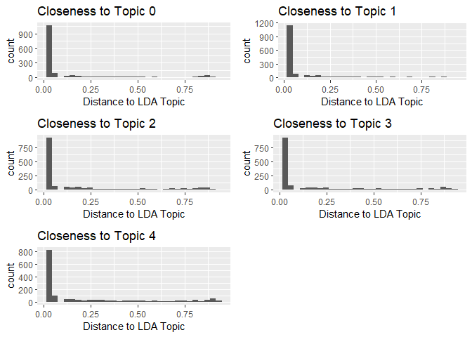
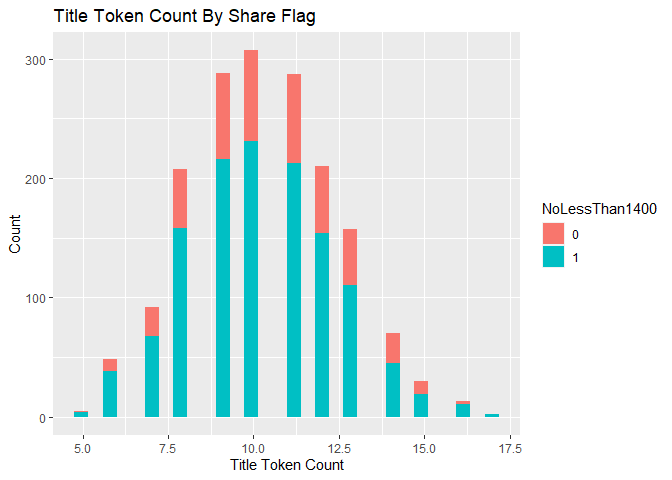

WeekDay Report
================
Xinyu Hu
6/30/2020

  - [Introduction](#introduction)
  - [About the data](#about-the-data)
  - [Summarization](#summarization)
      - [Simple Statistics](#simple-statistics)
      - [Simple Plots](#simple-plots)
      - [Plot with Response](#plot-with-response)
  - [Modeling](#modeling)
      - [Ensemble model](#ensemble-model)
      - [Linear Regression Model](#linear-regression-model)
  - [Conclusion](#conclusion)

# Introduction

This is a practice project of ST558 course at NC State. The data is
offered by [UCI Machine Learning
Repository](https://archive.ics.uci.edu/ml/datasets/Online+News+Popularity).  
The data set is made of statistics associsated with articles published
by Mashable. It includes 61 attributes, among which are 58 predictive
attributes, 2 non-predictive and 1 goal (reponse) field.  
The goal of this project, from my perspective, is practicing modeling
using R with both linear model and non linear model.The purpose of this
project is to find a relatively better way to predict *Number of Shares*
of those articles, using the provided associated statistics.

# About the data

**Row-wise, this analysis is about the weekday
    of**

    ## [1] weekday_is_saturday

``` r
colnames(News)
```

    ##  [1] "url"                           "timedelta"                     "n_tokens_title"                "n_tokens_content"              "n_unique_tokens"              
    ##  [6] "n_non_stop_words"              "n_non_stop_unique_tokens"      "num_hrefs"                     "num_self_hrefs"                "num_imgs"                     
    ## [11] "num_videos"                    "average_token_length"          "num_keywords"                  "data_channel_is_lifestyle"     "data_channel_is_entertainment"
    ## [16] "data_channel_is_bus"           "data_channel_is_socmed"        "data_channel_is_tech"          "data_channel_is_world"         "kw_min_min"                   
    ## [21] "kw_max_min"                    "kw_avg_min"                    "kw_min_max"                    "kw_max_max"                    "kw_avg_max"                   
    ## [26] "kw_min_avg"                    "kw_max_avg"                    "kw_avg_avg"                    "self_reference_min_shares"     "self_reference_max_shares"    
    ## [31] "self_reference_avg_sharess"    "weekday_is_monday"             "weekday_is_tuesday"            "weekday_is_wednesday"          "weekday_is_thursday"          
    ## [36] "weekday_is_friday"             "weekday_is_saturday"           "weekday_is_sunday"             "is_weekend"                    "LDA_00"                       
    ## [41] "LDA_01"                        "LDA_02"                        "LDA_03"                        "LDA_04"                        "global_subjectivity"          
    ## [46] "global_sentiment_polarity"     "global_rate_positive_words"    "global_rate_negative_words"    "rate_positive_words"           "rate_negative_words"          
    ## [51] "avg_positive_polarity"         "min_positive_polarity"         "max_positive_polarity"         "avg_negative_polarity"         "min_negative_polarity"        
    ## [56] "max_negative_polarity"         "title_subjectivity"            "title_sentiment_polarity"      "abs_title_subjectivity"        "abs_title_sentiment_polarity" 
    ## [61] "shares"

**Column-wise, this analysis includes 61 fields.** According to the
[data
description](https://archive.ics.uci.edu/ml/datasets/Online+News+Popularity),
from column \#3 to columns \#60 are the predictors. While I have no
knowledge about each of them, I can see there are a couple of
perspecives that we can group them.  
1\) *Column 3 to Column 13* are all numeric predictors. Among them,
Column 3 to Column Column 7, and column 12 are about tokens of the
article; Column 8 to Column Column 11, and column 13 are about the
links, image, video, and keywords of the articles.  
2\) *Column 14 to Column 19* are all about the topic, or channel of the
data. So here it will tag 7 types of channels: Lifestyle, Entertainment,
Business, Social Media, Tech and World.  
3\) *Column 20 to Column 28* are all about key word. For example, worst
keyword, best keyword, average keyword, etc.  
4\) *Column 29 to Column 31* are about self reference. They capture the
min, avg and max shares of referenced atritles in mashable.  
5\) *Colun 32 to Column 29* is aboue the timing of the article. Those
are flags to tag out if the article is published in Monday to Sunday,
and also if it’s on weekend.  
6\) *Column 40 to Column 44* are about the Closeness to LDA topics, with
topic 0 to topic 4 respectively.  
7\) *Colum 45 to Column 60* are all about [Natural Language Processing
(NLP)](https://en.wikipedia.org/wiki/Natural_language_processing) result
of the artcle. They include polarity, subjectivity, sentiment of the
article.

To start the analysis, we first look at Monday data, and use Rmarkdown
*Knit with Parameter* for all the weekdays. Also, a 70-30 split will be
made for modeling training and testing. Last but not least, I choose to
predict a binary response, which is dividing the shares into two groups
(\< 1400 and \>=1400).

# Summarization

As all the predictors are numeric, now we can start to explore some
feature of them.

## Simple Statistics

1)  Variables describing the tokens are of great interest of me. So I
    want to know the simple statistics before I jump into prediction
    (also I can check if there is any
    missing).

<!-- end list -->

``` r
summary(DataTrain[,3:7])
```

    ##  n_tokens_title  n_tokens_content n_unique_tokens  n_non_stop_words n_non_stop_unique_tokens
    ##  Min.   : 5.00   Min.   :   0.0   Min.   :0.0000   Min.   :0.0000   Min.   :0.0000          
    ##  1st Qu.: 9.00   1st Qu.: 283.0   1st Qu.:0.4587   1st Qu.:1.0000   1st Qu.:0.6130          
    ##  Median :10.00   Median : 509.5   Median :0.5192   Median :1.0000   Median :0.6741          
    ##  Mean   :10.31   Mean   : 611.1   Mean   :0.5152   Mean   :0.9689   Mean   :0.6592          
    ##  3rd Qu.:12.00   3rd Qu.: 797.8   3rd Qu.:0.5916   3rd Qu.:1.0000   3rd Qu.:0.7364          
    ##  Max.   :18.00   Max.   :7034.0   Max.   :0.9574   Max.   :1.0000   Max.   :1.0000

2)  Another interesting perspectives are about the NLP metrics. So I
    perform summary function on them as well (also I can check if there
    is any
    missing):

<!-- end list -->

``` r
summary(DataTrain[,47:58])
```

    ##  global_rate_positive_words global_rate_negative_words rate_positive_words rate_negative_words avg_positive_polarity min_positive_polarity max_positive_polarity
    ##  Min.   :0.00000            Min.   :0.00000            Min.   :0.0000      Min.   :0.0000      Min.   :0.0000        Min.   :0.00000       Min.   :0.0000       
    ##  1st Qu.:0.02904            1st Qu.:0.01034            1st Qu.:0.6000      1st Qu.:0.1875      1st Qu.:0.3143        1st Qu.:0.05000       1st Qu.:0.6000       
    ##  Median :0.04083            Median :0.01576            Median :0.7123      Median :0.2800      Median :0.3680        Median :0.10000       Median :0.8000       
    ##  Mean   :0.04122            Mean   :0.01717            Mean   :0.6814      Mean   :0.2875      Mean   :0.3599        Mean   :0.08961       Mean   :0.7843       
    ##  3rd Qu.:0.05303            3rd Qu.:0.02214            3rd Qu.:0.8000      3rd Qu.:0.3810      3rd Qu.:0.4181        3rd Qu.:0.10000       3rd Qu.:1.0000       
    ##  Max.   :0.12162            Max.   :0.18493            Max.   :1.0000      Max.   :1.0000      Max.   :1.0000        Max.   :1.00000       Max.   :1.0000       
    ##  avg_negative_polarity min_negative_polarity max_negative_polarity title_subjectivity title_sentiment_polarity
    ##  Min.   :-1.0000       Min.   :-1.000        Min.   :-1.0000       Min.   :0.0000     Min.   :-1.0000         
    ##  1st Qu.:-0.3381       1st Qu.:-0.800        1st Qu.:-0.1250       1st Qu.:0.0000     1st Qu.: 0.0000         
    ##  Median :-0.2625       Median :-0.500        Median :-0.1000       Median :0.1667     Median : 0.0000         
    ##  Mean   :-0.2697       Mean   :-0.561        Mean   :-0.1055       Mean   :0.2823     Mean   : 0.0953         
    ##  3rd Qu.:-0.2000       3rd Qu.:-0.400        3rd Qu.:-0.0500       3rd Qu.:0.5000     3rd Qu.: 0.2000         
    ##  Max.   : 0.0000       Max.   : 0.000        Max.   : 0.0000       Max.   :1.0000     Max.   : 1.0000

## Simple Plots

1)  One group of predictors that could be very helpful is the channel
    for each articles. So Understanding how many articles in each
    channel will be a “good to
know”.

<!-- end list -->

``` r
DataTrain["data_channel"] <- ifelse(DataTrain$data_channel_is_lifestyle==1, 'Lifestyle',
                             ifelse(DataTrain$data_channel_is_entertainment==1, 'Entertainment',
                             ifelse(DataTrain$data_channel_is_bus==1,'Business',
                             ifelse(DataTrain$data_channel_is_socmed==1,'Social Media',
                             ifelse(DataTrain$data_channel_is_tech==1, 'Tech',
                             ifelse(DataTrain$data_channel_is_world==1,"World",NA))))))
library(ggplot2)
plot1<-ggplot(data=DataTrain,aes(data_channel))
plot1 + geom_bar(color="black", fill="blue", size=2)+labs(x = "Channels")
```

<!-- -->

2)  Another interesting point to know before modeling is LDA topics
    distribution. So perform the same exploratory visualization here:

<!-- end list -->

``` r
library(ggpubr)
ggarrange(plot2, plot3, plot4, plot5, plot6, ncol = 2, nrow = 3)
```

<!-- -->

## Plot with Response

1)  One interesting point is to look at the density/distribution of
    average token length by the flag of being shared more than 1,400
    times or not:

<!-- end list -->

``` r
library(wesanderson)
plot7<- ggplot(DataTrain,aes(x=average_token_length, fill=NoLessThan1400)) 
plot7 + geom_histogram(aes(y=..density..))+geom_density(adjust=0.25,alpha=0.5)+ labs(title="Average Token Length By Share Flag", x ="Average Token Length", y = "Count")
```

<!-- -->

2)  Another intersting point is to look at number of images, to see if
    the density/distribution are different across the shaing flag (1
    mean “Yes”, 0 means “No”):

<!-- end list -->

``` r
library(wesanderson)
plot8<- ggplot(DataTrain,aes(x=n_tokens_title, fill=NoLessThan1400)) 
plot8 + geom_histogram() + labs(title="Title Token Count By Share Flag",
        x ="Title Token Count", y = "Count")
```

<!-- -->

# Modeling

## Ensemble model

Here, I pick bagged tree as preferred approach. The model training and
tuning is based on
[**Cross-validation**](https://en.wikipedia.org/wiki/Cross-validation_\(statistics\)#:~:text=Cross%2Dvalidation%2C%20sometimes%20called%20rotation,to%20an%20independent%20data%20set.).
This method first splits the whole dataset into k folds (here I pick
10). Then, it trains model using 9 folds of data and tuning with 1
remaining fold of data. With inherent cross validation, The CV method
will make very good use of existing data, and have relatively good
result.

``` r
library(caret)
trCtrl <- trainControl(method = "cv", number = 10)
bagfitTree<- train (NoLessThan1400 ~ ., data = DataTrain[,c(3:60,62)], method = "treebag",
                       trControl = trCtrl, metric = "Accuracy")
bagfitTree
```

    ## Bagged CART 
    ## 
    ## 1962 samples
    ##   58 predictor
    ##    2 classes: '0', '1' 
    ## 
    ## No pre-processing
    ## Resampling: Cross-Validated (10 fold) 
    ## Summary of sample sizes: 1765, 1766, 1765, 1766, 1766, 1767, ... 
    ## Resampling results:
    ## 
    ##   Accuracy   Kappa    
    ##   0.7640256  0.2428648

With the bagged tree model, we can apply to the **training dataset** to
see how good (*overfitting*) it
is:

``` r
BaggedTree_TrainingDatePrediction <- predict(bagfitTree, newdata=dplyr::select(DataTrain,-NoLessThan1400))
Result1 <- table(BaggedTree_TrainingDatePrediction,DataTrain$NoLessThan1400)
Result1
```

    ##                                  
    ## BaggedTree_TrainingDatePrediction    0    1
    ##                                 0  494    0
    ##                                 1    4 1464

The associated miss-classification rate is:

``` r
misClass1 <- 1 - sum(diag(Result1))/sum(Result1)
misClass1
```

    ## [1] 0.002038736

Also, we can apply the model to the **test dataset** to see how good
(*honest check*) it
is:

``` r
BaggedTree_TestDatePrediction <- predict(bagfitTree, newdata=dplyr::select(DataTest,-NoLessThan1400))
Result2 <- table(BaggedTree_TestDatePrediction,DataTest$NoLessThan1400)
Result2
```

    ##                              
    ## BaggedTree_TestDatePrediction   0   1
    ##                             0  30  29
    ##                             1  97 335

The associated miss-classification rate is:

``` r
misClass2 <- 1 - sum(diag(Result2))/sum(Result2)
misClass2
```

    ## [1] 0.2566191

## Linear Regression Model

I decide to use stepwise selection to choose the best regression model,
with AIC as the fit measurement. [**Akaike Information
Criterion**](https://en.wikipedia.org/wiki/Akaike_information_criterion)
is a very handy measurement to compare the model fit. It starts with a
set of candidate models, and then find the models’ corresponding AIC
values. Then it picks the model that minimizes the information loss
among the candidate models. It penalize number of predictors to avoid
overfitting.

``` r
library(MASS)
full_model <- glm(NoLessThan1400 ~., data = DataTrain[,c(3:60,62)], family=binomial)
step_model <- stepAIC(full_model, direction = "both", trace = FALSE)
summary(step_model)
```

    ## 
    ## Call:
    ## glm(formula = NoLessThan1400 ~ n_tokens_content + n_unique_tokens + 
    ##     n_non_stop_unique_tokens + num_hrefs + num_self_hrefs + average_token_length + 
    ##     num_keywords + data_channel_is_socmed + data_channel_is_tech + 
    ##     kw_min_min + kw_min_max + kw_max_max + kw_max_avg + kw_avg_avg + 
    ##     self_reference_min_shares + LDA_00 + LDA_01 + LDA_02 + LDA_03 + 
    ##     global_sentiment_polarity + global_rate_positive_words + 
    ##     global_rate_negative_words + rate_positive_words + max_negative_polarity + 
    ##     title_sentiment_polarity + abs_title_sentiment_polarity, 
    ##     family = binomial, data = DataTrain[, c(3:60, 62)])
    ## 
    ## Deviance Residuals: 
    ##     Min       1Q   Median       3Q      Max  
    ## -3.3325  -0.8467   0.5326   0.7585   1.7874  
    ## 
    ## Coefficients:
    ##                                Estimate Std. Error z value Pr(>|z|)    
    ## (Intercept)                  -2.295e-01  7.941e-01  -0.289 0.772551    
    ## n_tokens_content              4.184e-04  2.115e-04   1.978 0.047941 *  
    ## n_unique_tokens               5.730e+00  1.896e+00   3.023 0.002504 ** 
    ## n_non_stop_unique_tokens     -3.690e+00  1.480e+00  -2.493 0.012655 *  
    ## num_hrefs                     1.661e-02  6.615e-03   2.511 0.012035 *  
    ## num_self_hrefs               -5.836e-02  1.383e-02  -4.218 2.46e-05 ***
    ## average_token_length         -4.983e-01  1.639e-01  -3.040 0.002363 ** 
    ## num_keywords                  1.278e-01  3.256e-02   3.924 8.70e-05 ***
    ## data_channel_is_socmed        6.469e-01  2.895e-01   2.235 0.025436 *  
    ## data_channel_is_tech          4.230e-01  2.344e-01   1.805 0.071122 .  
    ## kw_min_min                    4.119e-03  2.196e-03   1.875 0.060742 .  
    ## kw_min_max                   -1.751e-06  9.517e-07  -1.840 0.065839 .  
    ## kw_max_max                   -1.093e-06  7.335e-07  -1.490 0.136332    
    ## kw_max_avg                   -5.260e-05  1.545e-05  -3.405 0.000662 ***
    ## kw_avg_avg                    3.843e-04  1.011e-04   3.800 0.000145 ***
    ## self_reference_min_shares     1.661e-05  9.662e-06   1.719 0.085604 .  
    ## LDA_00                        1.652e+00  4.188e-01   3.945 7.99e-05 ***
    ## LDA_01                       -9.015e-01  3.822e-01  -2.359 0.018338 *  
    ## LDA_02                       -8.536e-01  3.655e-01  -2.335 0.019529 *  
    ## LDA_03                       -7.200e-01  3.678e-01  -1.958 0.050256 .  
    ## global_sentiment_polarity    -1.892e+00  1.063e+00  -1.780 0.075095 .  
    ## global_rate_positive_words   -1.407e+01  6.681e+00  -2.106 0.035172 *  
    ## global_rate_negative_words    1.668e+01  1.106e+01   1.508 0.131660    
    ## rate_positive_words           3.764e+00  1.001e+00   3.760 0.000170 ***
    ## max_negative_polarity         1.163e+00  6.402e-01   1.817 0.069155 .  
    ## title_sentiment_polarity      5.337e-01  2.479e-01   2.153 0.031314 *  
    ## abs_title_sentiment_polarity -4.126e-01  2.887e-01  -1.429 0.152994    
    ## ---
    ## Signif. codes:  0 '***' 0.001 '**' 0.01 '*' 0.05 '.' 0.1 ' ' 1
    ## 
    ## (Dispersion parameter for binomial family taken to be 1)
    ## 
    ##     Null deviance: 2222.9  on 1961  degrees of freedom
    ## Residual deviance: 1933.4  on 1935  degrees of freedom
    ## AIC: 1987.4
    ## 
    ## Number of Fisher Scoring iterations: 5

Same as bagged tree model, we can apply the final model coming out from
stepwise select to the **training dataset** to see how good
(*overfitting*) it
is:

``` r
StepModel_TrainingDatePrediction <- predict(step_model, newdata=dplyr::select(DataTrain,-NoLessThan1400),type="response")
StepModel_TrainingDatePrediction <- as.numeric(StepModel_TrainingDatePrediction >= 0.5)
Result3 <- table(StepModel_TrainingDatePrediction,DataTrain$NoLessThan1400)
Result3 
```

    ##                                 
    ## StepModel_TrainingDatePrediction    0    1
    ##                                0  122   76
    ##                                1  376 1388

The associated miss-classification rate is:

``` r
misClass3 <- 1 - sum(diag(Result3))/sum(Result3)
misClass3
```

    ## [1] 0.2303772

Also, we can apply the model to the **test dataset** to see how good
(*honest check*) it
is:

``` r
StepModel_TestDatePrediction <- predict(step_model, newdata=dplyr::select(DataTest,-NoLessThan1400), type="response")
StepModel_TestDatePrediction <- as.numeric(StepModel_TestDatePrediction >= 0.5)
Result4 <- table(StepModel_TestDatePrediction,DataTest$NoLessThan1400)
Result4
```

    ##                             
    ## StepModel_TestDatePrediction   0   1
    ##                            0  23  31
    ##                            1 104 333

The associated miss-classification rate is:

``` r
misClass4 <- 1 - sum(diag(Result4))/sum(Result4)
misClass4
```

    ## [1] 0.2749491

# Conclusion

Based on my knowledge, The miss-classification rate of the test data set
is a very solid comparison measurement. So I will tag the model with
smallest test data miss-classification rate as the final model.

``` r
 if(misClass2 >= misClass4){
 FinalModel <-bagfitTree
noquote("The Better Model is Bagged Tree Model")
 }else{
 FinalModel <- step_model
noquote("The Better Model is (Step) Logistic Regression Model")}
```

    ## [1] The Better Model is (Step) Logistic Regression Model

Beyond this project, I think a better approach would be replicate the
whole process 100 times, obtain the mis-classification rate of both
model 100 times. Then compare to see how many times that Bagged Tree
beats logistric regression model, and how many times the other way
around. That would be very helpful to determine the stability of both
models performance.
