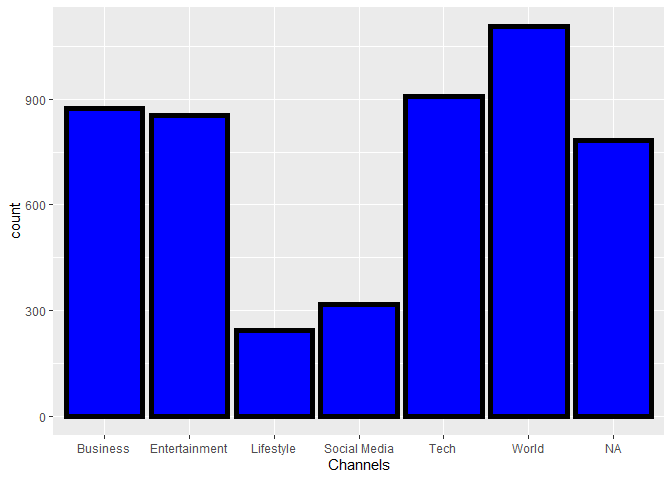
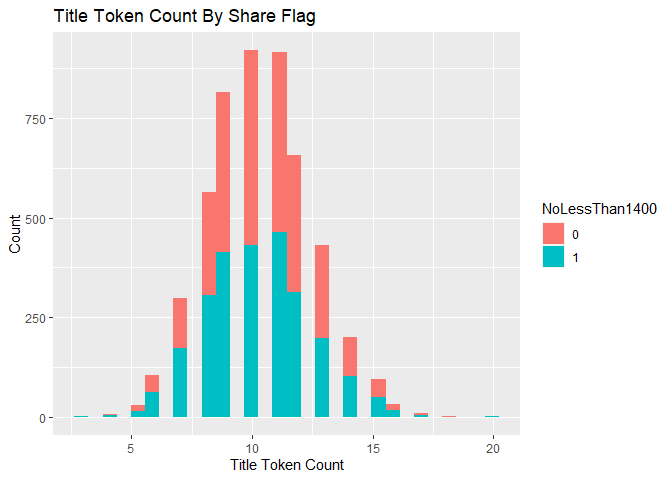

WeekDay Report
================
Xinyu Hu
6/30/2020

  - [Introduction](#introduction)
  - [About the data](#about-the-data)
  - [Summarization](#summarization)
      - [Simple Statistics](#simple-statistics)
      - [Simple Plots](#simple-plots)
      - [Plot with Response](#plot-with-response)
  - [Modeling](#modeling)
      - [Ensemble model](#ensemble-model)
      - [Linear Regression Model](#linear-regression-model)
  - [Conclusion](#conclusion)

# Introduction

This is a practice project of ST558 course at NC State. The data is
offered by [UCI Machine Learning
Repository](https://archive.ics.uci.edu/ml/datasets/Online+News+Popularity).  
The data set is made of statistics associsated with articles published
by Mashable. It includes 61 attributes, among which are 58 predictive
attributes, 2 non-predictive and 1 goal (reponse) field.  
The goal of this project, from my perspective, is practicing modeling
using R with both linear model and non linear model.The purpose of this
project is to find a relatively better way to predict *Number of Shares*
of those articles, using the provided associated statistics.

# About the data

**Row-wise, this analysis is about the weekday
    of**

    ## [1] weekday_is_thursday

``` r
colnames(News)
```

    ##  [1] "url"                           "timedelta"                     "n_tokens_title"               
    ##  [4] "n_tokens_content"              "n_unique_tokens"               "n_non_stop_words"             
    ##  [7] "n_non_stop_unique_tokens"      "num_hrefs"                     "num_self_hrefs"               
    ## [10] "num_imgs"                      "num_videos"                    "average_token_length"         
    ## [13] "num_keywords"                  "data_channel_is_lifestyle"     "data_channel_is_entertainment"
    ## [16] "data_channel_is_bus"           "data_channel_is_socmed"        "data_channel_is_tech"         
    ## [19] "data_channel_is_world"         "kw_min_min"                    "kw_max_min"                   
    ## [22] "kw_avg_min"                    "kw_min_max"                    "kw_max_max"                   
    ## [25] "kw_avg_max"                    "kw_min_avg"                    "kw_max_avg"                   
    ## [28] "kw_avg_avg"                    "self_reference_min_shares"     "self_reference_max_shares"    
    ## [31] "self_reference_avg_sharess"    "weekday_is_monday"             "weekday_is_tuesday"           
    ## [34] "weekday_is_wednesday"          "weekday_is_thursday"           "weekday_is_friday"            
    ## [37] "weekday_is_saturday"           "weekday_is_sunday"             "is_weekend"                   
    ## [40] "LDA_00"                        "LDA_01"                        "LDA_02"                       
    ## [43] "LDA_03"                        "LDA_04"                        "global_subjectivity"          
    ## [46] "global_sentiment_polarity"     "global_rate_positive_words"    "global_rate_negative_words"   
    ## [49] "rate_positive_words"           "rate_negative_words"           "avg_positive_polarity"        
    ## [52] "min_positive_polarity"         "max_positive_polarity"         "avg_negative_polarity"        
    ## [55] "min_negative_polarity"         "max_negative_polarity"         "title_subjectivity"           
    ## [58] "title_sentiment_polarity"      "abs_title_subjectivity"        "abs_title_sentiment_polarity" 
    ## [61] "shares"

**Column-wise, this analysis includes 61 fields.** According to the
[data
description](https://archive.ics.uci.edu/ml/datasets/Online+News+Popularity),
from column \#3 to columns \#60 are the predictors. While I have no
knowledge about each of them, I can see there are a couple of
perspecives that we can group them.  
1\) *Column 3 to Column 13* are all numeric predictors. Among them,
Column 3 to Column Column 7, and column 12 are about tokens of the
article; Column 8 to Column Column 11, and column 13 are about the
links, image, video, and keywords of the articles.  
2\) *Column 14 to Column 19* are all about the topic, or channel of the
data. So here it will tag 7 types of channels: Lifestyle, Entertainment,
Business, Social Media, Tech and World.  
3\) *Column 20 to Column 28* are all about key word. For example, worst
keyword, best keyword, average keyword, etc.  
4\) *Column 29 to Column 31* are about self reference. They capture the
min, avg and max shares of referenced atritles in mashable.  
5\) *Colun 32 to Column 29* is aboue the timing of the article. Those
are flags to tag out if the article is published in Monday to Sunday,
and also if it’s on weekend.  
6\) *Column 40 to Column 44* are about the Closeness to LDA topics, with
topic 0 to topic 4 respectively.  
7\) *Colum 45 to Column 60* are all about [Natural Language Processing
(NLP)](https://en.wikipedia.org/wiki/Natural_language_processing) result
of the artcle. They include polarity, subjectivity, sentiment of the
article.

To start the analysis, we first look at Monday data, and use Rmarkdown
*Knit with Parameter* for all the weekdays. Also, a 70-30 split will be
made for modeling training and testing. Last but not least, I choose to
predict a binary response, which is dividing the shares into two groups
(\< 1400 and \>=1400).

# Summarization

As all the predictors are numeric, now we can start to explore some
feature of them.

## Simple Statistics

1)  Variables describing the tokens are of great interest of me. So I
    want to know the simple statistics before I jump into prediction
    (also I can check if there is any
    missing).

<!-- end list -->

``` r
summary(DataTrain[,3:7])
```

    ##  n_tokens_title  n_tokens_content n_unique_tokens  n_non_stop_words n_non_stop_unique_tokens
    ##  Min.   : 3.00   Min.   :   0     Min.   :0.0000   Min.   :0.0000   Min.   :0.0000          
    ##  1st Qu.: 9.00   1st Qu.: 244     1st Qu.:0.4729   1st Qu.:1.0000   1st Qu.:0.6268          
    ##  Median :10.00   Median : 396     Median :0.5419   Median :1.0000   Median :0.6920          
    ##  Mean   :10.32   Mean   : 536     Mean   :0.5324   Mean   :0.9711   Mean   :0.6744          
    ##  3rd Qu.:12.00   3rd Qu.: 696     3rd Qu.:0.6096   3rd Qu.:1.0000   3rd Qu.:0.7545          
    ##  Max.   :20.00   Max.   :6159     Max.   :0.9545   Max.   :1.0000   Max.   :1.0000

2)  Another interesting perspectives are about the NLP metrics. So I
    perform summary function on them as well (also I can check if there
    is any
    missing):

<!-- end list -->

``` r
summary(DataTrain[,47:58])
```

    ##  global_rate_positive_words global_rate_negative_words rate_positive_words rate_negative_words avg_positive_polarity
    ##  Min.   :0.00000            Min.   :0.000000           Min.   :0.0000      Min.   :0.0000      Min.   :0.0000       
    ##  1st Qu.:0.02874            1st Qu.:0.009401           1st Qu.:0.6000      1st Qu.:0.1818      1st Qu.:0.3046       
    ##  Median :0.03871            Median :0.015385           Median :0.7143      Median :0.2778      Median :0.3579       
    ##  Mean   :0.03950            Mean   :0.016510           Mean   :0.6841      Mean   :0.2870      Mean   :0.3527       
    ##  3rd Qu.:0.05021            3rd Qu.:0.021622           3rd Qu.:0.8000      3rd Qu.:0.3818      3rd Qu.:0.4119       
    ##  Max.   :0.15278            Max.   :0.162037           Max.   :1.0000      Max.   :1.0000      Max.   :0.8500       
    ##  min_positive_polarity max_positive_polarity avg_negative_polarity min_negative_polarity max_negative_polarity
    ##  Min.   :0.00000       Min.   :0.000         Min.   :-1.0000       Min.   :-1.0000       Min.   :-1.0000      
    ##  1st Qu.:0.05000       1st Qu.:0.600         1st Qu.:-0.3252       1st Qu.:-0.7000       1st Qu.:-0.1250      
    ##  Median :0.10000       Median :0.800         Median :-0.2514       Median :-0.5000       Median :-0.1000      
    ##  Mean   :0.09611       Mean   :0.752         Mean   :-0.2571       Mean   :-0.5153       Mean   :-0.1078      
    ##  3rd Qu.:0.10000       3rd Qu.:1.000         3rd Qu.:-0.1851       3rd Qu.:-0.3000       3rd Qu.:-0.0500      
    ##  Max.   :0.80000       Max.   :1.000         Max.   : 0.0000       Max.   : 0.0000       Max.   : 0.0000      
    ##  title_subjectivity title_sentiment_polarity
    ##  Min.   :0.0000     Min.   :-1.00000        
    ##  1st Qu.:0.0000     1st Qu.: 0.00000        
    ##  Median :0.1818     Median : 0.00000        
    ##  Mean   :0.2870     Mean   : 0.07277        
    ##  3rd Qu.:0.5000     3rd Qu.: 0.15000        
    ##  Max.   :1.0000     Max.   : 1.00000

## Simple Plots

1)  One group of predictors that could be very helpful is the channel
    for each articles. So Understanding how many articles in each
    channel will be a “good to
know”.

<!-- end list -->

``` r
DataTrain["data_channel"] <- ifelse(DataTrain$data_channel_is_lifestyle==1, 'Lifestyle',
                             ifelse(DataTrain$data_channel_is_entertainment==1, 'Entertainment',
                             ifelse(DataTrain$data_channel_is_bus==1,'Business',
                             ifelse(DataTrain$data_channel_is_socmed==1,'Social Media',
                             ifelse(DataTrain$data_channel_is_tech==1, 'Tech',
                             ifelse(DataTrain$data_channel_is_world==1,"World",NA))))))
library(ggplot2)
plot1<-ggplot(data=DataTrain,aes(data_channel))
plot1 + geom_bar(color="black", fill="blue", size=2)+labs(x = "Channels")
```

<!-- -->

2)  Another interesting point to know before modeling is LDA topics
    distribution. So perform the same exploratory visualization here:

<!-- end list -->

``` r
library(ggpubr)
ggarrange(plot2, plot3, plot4, plot5, plot6, ncol = 2, nrow = 3)
```

<!-- -->

## Plot with Response

1)  One interesting point is to look at the density/distribution of
    average token length by the flag of being shared more than 1,400
    times or not:

<!-- end list -->

``` r
library(wesanderson)
plot7<- ggplot(DataTrain,aes(x=average_token_length, fill=NoLessThan1400)) 
plot7 + geom_histogram(aes(y=..density..))+geom_density(adjust=0.25,alpha=0.5)+ labs(title="Average Token Length By Share Flag", x ="Average Token Length", y = "Count")
```

<!-- --> 2)
Another intersting point is to look at number of images, to see if the
density/distribution are different across the shaing flag (1 mean “Yes”,
0 means “No”):

``` r
library(wesanderson)
plot8<- ggplot(DataTrain,aes(x=n_tokens_title, fill=NoLessThan1400)) 
plot8 + geom_histogram() + labs(title="Title Token Count By Share Flag",
        x ="Title Token Count", y = "Count")
```

<!-- -->

# Modeling

## Ensemble model

Here, I pick bagged tree as preferred approach. The model training and
tuning is based on
[**Cross-validation**](https://en.wikipedia.org/wiki/Cross-validation_\(statistics\)#:~:text=Cross%2Dvalidation%2C%20sometimes%20called%20rotation,to%20an%20independent%20data%20set.).
This method first split the whole dataset into k folds (here I pick 10).
Then, it trains model using 9 folds of data and tuning with 1 remaining
fold of data. With inherent cross validation, The CV method will make
very good use of existing data, and have relatively good result.

``` r
library(caret)
trCtrl <- trainControl(method = "cv", number = 10)
bagfitTree<- train (NoLessThan1400 ~ ., data = DataTrain[,c(3:60,62)], method = "treebag",
                       trControl = trCtrl, metric = "Accuracy")
bagfitTree
```

    ## Bagged CART 
    ## 
    ## 5813 samples
    ##   58 predictor
    ##    2 classes: '0', '1' 
    ## 
    ## No pre-processing
    ## Resampling: Cross-Validated (10 fold) 
    ## Summary of sample sizes: 5231, 5232, 5232, 5232, 5232, 5232, ... 
    ## Resampling results:
    ## 
    ##   Accuracy   Kappa    
    ##   0.6230826  0.2460723

With the bagged tree model, we can apply to the **training dataset** to
see how good (*overfitting*) it
is:

``` r
BaggedTree_TrainingDatePrediction <- predict(bagfitTree, newdata=dplyr::select(DataTrain,-NoLessThan1400))
Result1 <- table(BaggedTree_TrainingDatePrediction,DataTrain$NoLessThan1400)
Result1
```

    ##                                  
    ## BaggedTree_TrainingDatePrediction    0    1
    ##                                 0 2890    2
    ##                                 1    2 2919

The associated miss-classification rate is:

``` r
misClass1 <- 1 - sum(diag(Result1))/sum(Result1)
misClass1
```

    ## [1] 0.0006881129

Also, we can apply the model to the **test dataset** to see how good
(*honest check*) it
is:

``` r
BaggedTree_TestDatePrediction <- predict(bagfitTree, newdata=dplyr::select(DataTest,-NoLessThan1400))
Result2 <- table(BaggedTree_TestDatePrediction,DataTest$NoLessThan1400)
Result2
```

    ##                              
    ## BaggedTree_TestDatePrediction   0   1
    ##                             0 448 242
    ##                             1 258 506

The associated miss-classification rate is:

``` r
misClass2 <- 1 - sum(diag(Result2))/sum(Result2)
misClass2
```

    ## [1] 0.343879

## Linear Regression Model

I decide to use Stepwise selection to choose the best regression model,
with AIC as the fit measurement. [**Akaike Information
Criterion**](https://en.wikipedia.org/wiki/Akaike_information_criterion)
is a very handy measurement to compare the model fit. It starts with a
set of candidate models, and then find the models’ corresponding AIC
values. Then it picks the model that minimizes the information loss
among the candidate models. It penalize number of predictors to avoid
overfitting.

``` r
library(MASS)
full_model <- glm(NoLessThan1400 ~., data = DataTrain[,c(3:60,62)], family=binomial)
step_model <- stepAIC(full_model, direction = "both", trace = FALSE)
summary(step_model)
```

    ## 
    ## Call:
    ## glm(formula = NoLessThan1400 ~ n_tokens_content + n_non_stop_words + 
    ##     n_non_stop_unique_tokens + num_keywords + data_channel_is_lifestyle + 
    ##     data_channel_is_entertainment + data_channel_is_bus + data_channel_is_socmed + 
    ##     data_channel_is_tech + data_channel_is_world + kw_min_min + 
    ##     kw_min_max + kw_avg_max + kw_min_avg + kw_max_avg + kw_avg_avg + 
    ##     self_reference_avg_sharess + LDA_00 + LDA_02 + global_subjectivity + 
    ##     global_rate_positive_words + global_rate_negative_words + 
    ##     rate_positive_words + rate_negative_words + min_positive_polarity + 
    ##     title_sentiment_polarity + abs_title_subjectivity, family = binomial, 
    ##     data = DataTrain[, c(3:60, 62)])
    ## 
    ## Deviance Residuals: 
    ##     Min       1Q   Median       3Q      Max  
    ## -2.9791  -1.0476   0.3806   1.0644   2.0136  
    ## 
    ## Coefficients:
    ##                                 Estimate Std. Error z value Pr(>|z|)    
    ## (Intercept)                   -1.926e+00  3.303e-01  -5.830 5.53e-09 ***
    ## n_tokens_content               1.905e-04  8.746e-05   2.178  0.02943 *  
    ## n_non_stop_words              -2.005e+07  1.078e+07  -1.860  0.06288 .  
    ## n_non_stop_unique_tokens      -1.263e+00  4.110e-01  -3.073  0.00212 ** 
    ## num_keywords                   3.828e-02  1.755e-02   2.182  0.02914 *  
    ## data_channel_is_lifestyle      3.412e-01  1.587e-01   2.150  0.03156 *  
    ## data_channel_is_entertainment -2.830e-01  1.168e-01  -2.423  0.01541 *  
    ## data_channel_is_bus            3.129e-01  1.655e-01   1.891  0.05869 .  
    ## data_channel_is_socmed         1.141e+00  1.728e-01   6.603 4.02e-11 ***
    ## data_channel_is_tech           8.040e-01  1.213e-01   6.626 3.45e-11 ***
    ## data_channel_is_world          3.233e-01  1.619e-01   1.997  0.04581 *  
    ## kw_min_min                     2.897e-03  5.245e-04   5.524 3.32e-08 ***
    ## kw_min_max                    -7.080e-07  5.004e-07  -1.415  0.15712    
    ## kw_avg_max                    -7.609e-07  3.614e-07  -2.105  0.03525 *  
    ## kw_min_avg                    -7.830e-05  3.774e-05  -2.075  0.03801 *  
    ## kw_max_avg                    -1.072e-04  1.370e-05  -7.823 5.16e-15 ***
    ## kw_avg_avg                     8.024e-04  7.689e-05  10.436  < 2e-16 ***
    ## self_reference_avg_sharess     6.389e-06  2.067e-06   3.091  0.00200 ** 
    ## LDA_00                         3.539e-01  1.981e-01   1.787  0.07395 .  
    ## LDA_02                        -4.811e-01  1.920e-01  -2.506  0.01223 *  
    ## global_subjectivity            1.592e+00  3.715e-01   4.285 1.82e-05 ***
    ## global_rate_positive_words    -5.064e+00  3.157e+00  -1.604  0.10873    
    ## global_rate_negative_words     1.144e+01  6.302e+00   1.815  0.06954 .  
    ## rate_positive_words            2.005e+07  1.078e+07   1.860  0.06288 .  
    ## rate_negative_words            2.005e+07  1.078e+07   1.860  0.06288 .  
    ## min_positive_polarity         -1.215e+00  4.836e-01  -2.512  0.01201 *  
    ## title_sentiment_polarity       2.200e-01  1.150e-01   1.914  0.05568 .  
    ## abs_title_subjectivity         2.399e-01  1.567e-01   1.531  0.12572    
    ## ---
    ## Signif. codes:  0 '***' 0.001 '**' 0.01 '*' 0.05 '.' 0.1 ' ' 1
    ## 
    ## (Dispersion parameter for binomial family taken to be 1)
    ## 
    ##     Null deviance: 8058.4  on 5812  degrees of freedom
    ## Residual deviance: 7338.4  on 5785  degrees of freedom
    ## AIC: 7394.4
    ## 
    ## Number of Fisher Scoring iterations: 5

Same as bagged tree model, we can apply the final model coming out from
stepwise select to the **training dataset** to see how good
(*overfitting*) it
is:

``` r
StepModel_TrainingDatePrediction <- predict(step_model, newdata=dplyr::select(DataTrain,-NoLessThan1400),type="response")
StepModel_TrainingDatePrediction <- as.numeric(StepModel_TrainingDatePrediction >= 0.5)
Result3 <- table(StepModel_TrainingDatePrediction,DataTrain$NoLessThan1400)
Result3 
```

    ##                                 
    ## StepModel_TrainingDatePrediction    0    1
    ##                                0 1907 1065
    ##                                1  985 1856

The associated miss-classification rate is:

``` r
misClass3 <- 1 - sum(diag(Result3))/sum(Result3)
misClass3
```

    ## [1] 0.3526578

Also, we can apply the model to the **test dataset** to see how good
(*honest check*) it
is:

``` r
StepModel_TestDatePrediction <- predict(step_model, newdata=dplyr::select(DataTest,-NoLessThan1400), type="response")
StepModel_TestDatePrediction <- as.numeric(StepModel_TestDatePrediction >= 0.5)
Result4 <- table(StepModel_TestDatePrediction,DataTest$NoLessThan1400)
Result4
```

    ##                             
    ## StepModel_TestDatePrediction   0   1
    ##                            0 449 266
    ##                            1 257 482

The associated miss-classification rate is:

``` r
misClass4 <- 1 - sum(diag(Result4))/sum(Result4)
misClass4
```

    ## [1] 0.3596974

# Conclusion

Based on my knowledge, The miss-classification rate of the test data set
is a very solid comparison measurement. So I will tag the model with
smallest test data miss-classification rate as the final model.

``` r
 if(misClass2 >= misClass4){
 FinalModel <-bagfitTree
noquote("The Better Model is Bagged Tree Model")
 }else{
 FinalModel <- step_model
noquote("The Better Model is (Step) Logistic Regression Model")}
```

    ## [1] The Better Model is (Step) Logistic Regression Model

Beyond this project, I think a better approach would be replicate the
whole process 100 times, obtain the mis-classification rate of both
model 100 times. Then compare to see how many times that Bagged Tree
beats logistric regression model, and how many times the other way
around. That would be very helpful to determine the stability of both
models performance.
